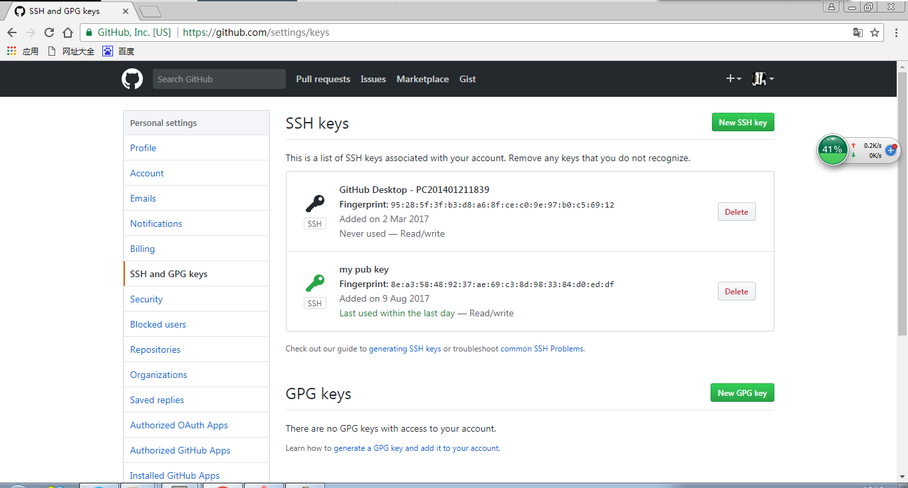

# LEARN GIT
___

## 汇总
___

**git是一种分布式管理工具，这种工具区别于集中式管理工具例如svn。**

集中式管理相当于所有的信息全都集中在一台主机上，当用户需要修改、提交必须从主机上下载即与主机建立连接。而git的分布式管理工具是在本地建立一个小型库用于存放主机上的内容，当需要提交只需在联网状态下推送即可（确切的来说git是将分布式与集中式相结合的一种版本管理工具）。

**git的三个区域：**git将文件的存储划分为三个区域，分别为本地的工作区、本地的版本区（其中版本区又划分出暂存区与主存区）、以及远程主机上的origin区。

**为什么会额外地划分出一个暂存区？**类似于购物网站中的收藏夹，当我们在工作区修改、更新大量的文件时，而我们又不能确定哪些文件是确定修改的，此时暂存区就彰显了它的作用所在，它可以将确定修改的文件集合然后一次提交。

**git的基本命令行语句：**

1. **提交。** 从工作区提交到暂存区（git add filename），从暂存区提交到主存区（git commit -m"提交内容描述"；m是comment的缩写，对该次提交节点的一个描述，方便下次查找）。从主存区提交到origin区（git push）。

2. **状态。** 查询工作区与版本区之间的差异（git status），无法查询工作区与版本之间的差异，我们只能通过（git pull）命令行将远程主机内容拉取到本地，本地内容将会显示远程主机与本地的差异内容，我们只需编辑该内容并按步骤提交即可。

3. **协议。** git有两种推送协议分别是http以及ssh，通过命令行（git remote -v；v是version的缩写）能查看当前的传输协议。http协议推送在每次推送时都会填写账户名和密码，所以日常中我们常常用ssh推送，将http协议转化成ssh协议命令行如下（1.git remote rm origin；2.git remote add origin git@github.com:XXXX/XXX.git;3.git push -u origin master；u参数你可以理解为‘undo’类似于一个绑定，之后就可以simple push了不用加远程主机和本地主机名。）

4. **绑定。** git有两种协议绑定http和ssh，绑定命令行（git remote add origin http address/ssh 密钥）

5. **分支。** git可以创建分支，通过命令行（1.git branch name；创建分支。2.git checkout name；切换分支。3.我们也可以通过以下命令行进行两步操作 git checkout -b name），当然创建分支之后便会有合并分支，git合并分支是将主分支指向分支节点，命令行（git merge <branchname>），在合并之后便是删除操作了（git branch -d <name>）

**SSH传输协议：**  

ssh英文为secure shell意为安全的壳。
	  
ssh有两种传输安全验证。  

第一种（基于口令的安全验证），当你知道账号密码就可以登录到远程主机进行文件传输，由于确认方只存在远程主机所以会存在别的服务器冒充真正服务器的安全隐患。  

第二种（基于密钥的安全验证），本地主机会生成一个密钥放在远程主机上，以便在传输过程中可以确认双方身份信息。  

以下操作基于windows下的git bash命令窗口： 
 
ssh-keygen -t ras -b 4096 -C "your email"+三次回车确认，会在本地主机生成公钥。  

通过命令语句：cat ~/.ssh/id_ras.pub可以查看到。密钥的绝对路径位于：c:/administrator/.ssh文件下，你可以查看该文件确认是否在本地主机生成公钥。  

将命令行显示公钥复制添加到远程主机可以是github也可以是其它地址。  

输入命令 ssh -T git@github.com查看密钥是否生效。  
	

## 第一部分 git新建文件

#### 初始化版本控制工具git  
--命令行：$ git init
#### 查看文件目录
--命令行：$ pwd  //非必要
#### 创建文件  
--命令行：$ touch filename  
#### 添加文件  
--命令行：$ git add filename  
#### 提交文件并留言  
--命令行：$ git commit -m "content"

命令语句缩写解释：  
pwd：print work directory  
m: message  

## 第二部分 git修改文件

git储存：本地git版本控制工具的储存分两个区域，工作区和版本库。  
版本库又分为：暂存区（stage）以及主存区（master）  

#### 修改文件而并未提交可以查看储存状态
命令行：$ git status
#### 需要查看修改文件的详细信息：  
命令行：$ git diff filename  

#### 命令语句缩写解释：
diff:different

## 第三部分 git回溯机制

### 回溯  

在git工具中HEAD代表当前版本，上一个版本是HEAD^，以此类推。  
回溯太远的话可以简写HEAD~12。
git中每一次对master的提交都有一个唯一的ID  
#### 我们可以回溯到当前版本
命令行语句：$ git reset --hard HEAD  
#### 当然也可以回溯版本号：  
命令行：$ git reset --hard commit_ID  
#### 也可以通过打印修改记录查看到版本号  
命令行：$ git log  
#### 有时候回溯会导致当前版本消失  
可以查看操作历史： $ git reflog
查看暂存区的命令：$ cat filename

### 删除

#### 删除工作区文件--直接调用命令行语句  
命令行：$ rm filename  
#### 查看储存状态--工作区和版本库文件不一致
命令行：$ git status  
1. 删除版本库文件
删除命令行：$ git rm filename
提交命令行：$ git commit -m 'content'
2. 恢复版本库文件  
恢复命令行： $ git checkout -- filename

## 第四部分 git远程仓库

git的定义是分布式版本控制系统，也就是说除了我们本身电脑上的仓库外，  
一定还存在着一个服务器仓库，控制交互着每一个共同开发者的仓库。  
以github网站为例。

### 创建远程仓库  

git和github之间的传输是通过SSH加密的，首先需要设置的就是SSH key。  
#### 在本地创建ssh key  
命令行： $ ssh-keygen -t rsa -C 'youremail@example.com'  
执行命令行会在本地（用户目录下）创建两个密钥，一个公钥id_rsa.pub，一个私钥id_rsa，在和github远程仓库进行绑定的时候会用到公钥。  
  
#### 创建远程仓库  
当我们在github上进行公钥连接，也就意味着本地取得远程仓库的使用权，接下来我们需要在github上创建远程仓库。  
 
  
创建完成后可以获取到远程仓库的地址，并让本地仓库与之关联。  
命令行： $ git remote add origin git@github.con:Wpcc.learnGit.git  
远程仓库需要换成与之关联的仓库。
由于第一次创建的远程仓库内容为空，我们需要进行第一次推送。  
命令行： $ git push -u origin master  

#### 克隆远程仓库  
命令行1：$ git clone git@github.com:Wpcc/learnGit.git  
命令行2：$ git clone https://github.com/Wpcc/learnGit.git 

#### 命令行解释  
-u 推送内容并让本地仓库与远程仓库关联 一般出现在第一次推送当中  

## 第五部分 本地分支  

### 创建合并分支  

#### 查看分支  
命令行： $ git branch  
#### 创建分支  
命令行： $ git branch (name)  
#### 切换分支  
命令行：$ git checkout (name)  
#### 创建+切换分支：  
命令行：$ git checkout -b (name)  
#### 合并某分支到当前分支：  
命令行：$ git merge (name)
#### 删除分支  
命令行： $ git branch -d (name)

### 分支冲突  
当本地两个分支有各自的修改，合并的时候会产生冲突，因为系统不知道哪种分支的修改需要保留，哪种分支的修改需要删除，这个时候我们需要手动修改。  
工作中我们可以创建多个分支。  
1. 与远程仓库紧密关联的主分支master。
2. 主要开发保管的分支dev。  
3. 修复常见漏洞的分支bug。
.....  

### 多人协作  
#### 查看远程库信息  
命令行： $ git remote -v  
#### 从本地推送分支/推送失败需要抓取远程信息  
命令行： $ git push origin (branch-name)
命令行： $ git pull  
#### 在本地创建和远程分支对应分支  
命令行： $ git checkout -b (branch-name) origin/(branch-name)  
#### 建立本地分支和远程分支的关联  
命令行： $ git branch --set-upstream (branch-name) origin/(branch-name)

## 第六部分 标签管理  

### 创建标签

#### 新建一个标签  
命令行： $ git tag (name)  
#### 新建标签并附上标签信息  
命令行： $ git tag -a (tagname) -m 'blablabla....'
#### 可以用PGP签名标签  
命令行： $ git tag -s (tagname) -m 'blablabla...'  
#### 查看所有标签  
命令行： $ git tag  

### 操作标签  

#### 推送本地标签  
命令行： $ git push origin (tagname)  
#### 推送全部本地标签  
命令行： $ git push origin --tags  
#### 删除本地标签  
命令行： $ git tag -d (tagname)  
#### 删除远程标签  
命令行： $ git push origin :refs/tags/(tagname)
